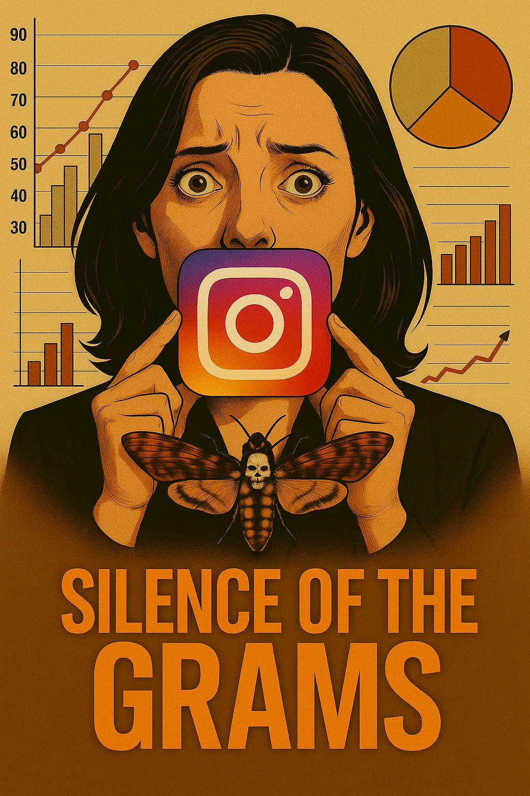

# 🚴‍♀️ Google Data Analytics Capstone Project

## 📘 Project Resources

* [Case study document](https://www.coursera.org/learn/google-data-analytics-capstone/supplement/7PGIT/case-study-1-how-does-a-bike-share-navigate-speedy-success)

## ❓ Key Questions

1. **How do annual members and casual riders use Cyclistic bikes differently?**
2. **Why would casual riders buy Cyclistic annual memberships?**
3. **How can Cyclistic use digital media to influence casual riders to become members?**

---

## 🧾 Project Summary

I am a junior data analyst at **Cyclistic**, working for the **marketing analytics team**.
The **director of marketing** believes future success depends on maximizing the number of annual memberships.

Our team was tasked with understanding how **casual riders** and **annual members** use Cyclistic bikes differently. Using these insights, we aim to help shape a new **marketing strategy** to convert casual riders into annual members.

These recommendations must be backed by **data** and **visualizations** to help the executive team approve the plan.

---

## 🔍 ASK Phase

In this phase, we define the problem clearly to align with stakeholder expectations.

> **Key business question:**
> *How do annual members and casual riders use Cyclistic bikes differently?*

---

## 🧭 Business Task

Cyclistic is a bike-share company based in **Chicago**. While **casual riders** (single-ride or full-day passes) make up a large user base, **annual members** generate more consistent revenue.

**Lily Moreno**, the Director of Marketing, wants to design a campaign to convert casual riders into members. Our role is to:

1. Analyze differences in ride behavior between user types
2. Identify reasons casual riders might become members
3. Explore how social media can influence conversion

---

## 👥 Stakeholders

* **Lily Moreno** – Director of Marketing (project lead)
* **Cyclistic Executive Team** – Final decision-makers

---

# Prepare phase

## 📂 Data Description

##Structured data

The dataset includes bike trip data for 2019 from Divvy, Chicago’s bike-share system. Each CSV contains:

*Trip start/end time and station

*Trip duration

*User type (member or casual)

*Rider demographics (where available)

*Geospatial metrics – to be investigated for meaningful patterns


Data was provided by Motivate International Inc. under an open data license and pulled externally from the Divvy website.


This dataset will form the basis for metrics required to derive insights. Relationships I want to explore include:


*Usertype vs time of day, week, and year of usage

*Age: Is there a correlation between user type and age? Can this inform targeted advertising?

*Gender: Are there gender gaps that could be addressed through marketing and engagement?

## Semi-structured data

I will explore social media platforms to extract meaningful engagement metrics, including:

*Post engagement (comments, likes)

*Followers/subscriber numbers


Note: All analysis and data are stored in a password-protected repository for security purposes.

---

# Process phase

## 🧹 Data Cleaning, Manipulation & Transformation

In this phase I will scan the data and look to remove any duplicates, columns that arent relevant to the analysis.

I will also calculate the approx age (a metric that is not given) of users by calculating their birthyear against the year of the dataset, this will enable us to determine meaningful age demographic insights, I will then remove the birth year column and transform the dataframe by adding a more meaningful age  column.

I will also carry out a FUZZYMATCHING search on place names to eliminate any consitenices in naming conventions.


### 🧷 Column Alignment

Q1, Q3, and Q4 had consistent column names, but **Q2 required renaming** due to inconsistent labels.
I used **blended data techniques** to rename Q2’s columns, enabling seamless integration into the main dataframe.


---

### 🧪 Trip Duration Formatting

Trip duration was converted into a more readable format (e.g. `7m45s`).
Code snippet located in `cleaning_and_transformation.R`.


---

### 🧼 Handling Missing Values

A summary of NA values showed that **gender** and **birthyear** were often missing:

```
gender      → 559,206 missing  
birthyear   → 538,751 missing
```

* **Gender:** Replaced all missing values with `"Unspecified"`
* **Birthyear:** Used the **mode** (`1992`) to replace missing values for analysis

Code snippets are in `cleaning_and_transformation.R` and `mean_age_column.R`.


# Analyse phase


---

# Share pahse

# 📱 Cyclistic’s Social Media Presence: A Missed Opportunity

## 🤔 Context

While structured data offered limited differentiation between user types, exploring **semi-structured sources** (social media and online reviews) revealed a deeper insight:

> Cyclistic has a **brand engagement gap**.

---

## 📉 Social Media Snapshot

From manual investigation of the real company Cyclistic is modeled on:

| Platform  | Followers | Avg Likes per Post |
| --------- | --------- | ------------------ |
| Twitter   | \~13,000  | < 10               |
| Instagram | \~6,000   | < 10               |

Despite having **3M+ annual rides**, Cyclistic's social engagement is **underwhelming**. This shows a lack of emotional connection to the brand — customers use the app, but they don't feel part of the community.

---

## 🤝 The Hidden Differentiator

Positive brand relationships encourage people to shift from casual use to committed subscription.
**Social media** can build those connections through:

* User-generated content
* Storytelling
* Community events
* Highlighting rider stories

---

## 📊 External Verification

According to HypeAuditor, @divvybikes has:

* Over **1,100 Instagram posts**
* An **average of 17 likes per post**
* A **0.28% likes-to-followers ratio**
* An inactive Tiktok account
* No Youtube channel

[HypeAuditor Data](https://github.com/user-attachments/assets/ce33c121-860b-4e60-984f-5eca721d73e2)

These low engagement numbers reinforce the insight:
Cyclistic is **underutilizing** its social channels as a tool for brand identity and customer retention.

---

# Act phase





🎯 Age Demographics: A Generational Divide

My analysis revealed that the average age of casual users is 28, while the average age of annual subscribers is 35. In today's marketing landscape, a seven-year age gap represents a meaningful difference in user behavior and digital expectations. This generational divide suggests that older users are more likely to value the long-term savings and convenience of a subscription, while younger users may favor the spontaneity of occasional, recreational rides.

📱 TikTok: A Missed Channel for Younger Engagement

Additionally, the company has no presence on TikTok, despite the platform being heavily favored by the 18–28 age demographic — which aligns closely with Cyclistic’s casual rider base. This represents a major missed opportunity to engage the very users most likely to convert with the right content strategy.

By embracing platform-native storytelling and short-form video formats, Cyclistic could increase visibility, foster brand connection, and ultimately convert casual users into loyal members — not just through cost incentives, but through community and identity.
